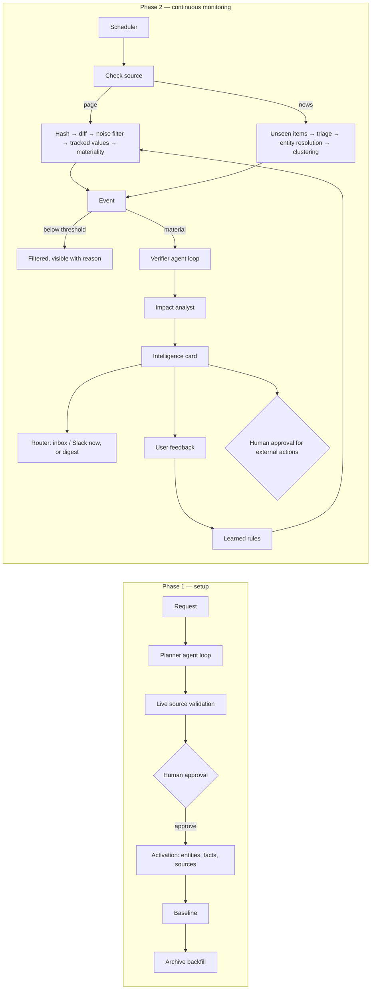

# SignalLens — Technical Documentation

This document describes how SignalLens is built: the architecture, the agent runtime, every
pipeline stage, the evidence and world-state models, the database, security, costs and
scaling. It describes the code as it exists in this repository. Where something is planned
but not built, it says so. The authoritative status list is `04-IMPLEMENTATION-STATUS.md`.

- Product explanation: `01-PRODUCT.md` · Spec review and design decisions: `00-SPEC-REVIEW.md`
- API contract (frontend ↔ backend): `api-contract.md`

---

## 1. System at a glance

```
                        ┌──────────────────────────── Next.js web app ───────────────────────────┐
  user ───────────────▶ │ onboarding · plan review · dashboard · cards · world state · traces     │
                        └──────────────┬───────────────────────────────────────────────────────────┘
                                       │ /api/*  (same-origin proxy, cookie session)
                        ┌──────────────▼────────────── FastAPI (backend/signallens/api) ──────────┐
                        │ auth · workspaces · plans · reports · world · monitoring · runs · approvals │
                        └──────────────┬──────────────────────────────────────────────▲──────────┘
                    writes rows + jobs │ (same transaction)                              │ reads
                        ┌──────────────▼──────────────────────────────────────────────┴──────────┐
                        │                     PostgreSQL (world state + job queue)                │
                        └──────────────▲──────────────────────────────────────────────┬──────────┘
                     claims jobs       │ FOR UPDATE SKIP LOCKED                        │
                        ┌──────────────┴──────────── Worker (backend/signallens/jobs) ─▼──────────┐
                        │ scheduler tick · pipelines · agent runtime (Planner, Verifier loops)    │
                        └───────┬───────────────┬───────────────┬───────────────┬────────────────┘
                                │               │               │               │
                          web pages      Internet Archive    search API     model APIs
                      (robots, SSRF)       (Wayback CDX)   (Tavily/Exa/    (Anthropic/OpenAI/
                                                            Serper)          Gemini)
```



**Stack.** Python 3.12, FastAPI, Pydantic v2, SQLAlchemy 2 (async) + asyncpg, Alembic,
PostgreSQL 17 (JSONB), httpx, lxml/BeautifulSoup/trafilatura, pypdf, rapidfuzz, tldextract.
Frontend: Next.js (App Router, TypeScript), Tailwind CSS, shadcn/ui, SWR. No Redis, no
Celery (see §9).

---

## 2. Repository layout

```
backend/
  signallens/
    config.py              settings (env / backend/.env)
    plan.py                MonitoringPlan contract (shared by API and pipeline)
    db/                    SQLAlchemy models, session helpers  (+ migrations/ via Alembic)
    llm/                   provider abstraction: Anthropic, OpenAI(-compatible), Gemini, ScriptedLLM
    search/                search abstraction: Tavily, Exa, Serper, StaticSearch
    fetch/                 safe fetcher (SSRF, robots.txt, politeness), extraction, Wayback client
    util/                  URL/publisher normalisation, text normalisation, quote verification
    domain/                pure product rules: evidence rubric, policy, severity, feedback,
                           clustering, diffing, scheduling, value equivalence
    runtime/               agent runtime: runs, steps, budgets, tools, loop, model gateway, services
    tools/                 agent tools: search, open page, archive, fact history, record evidence
    agents/                planner, investigator (loops); extractor, materiality, triage, impact (calls)
    store/                 database helpers shared by tools and pipelines
    pipeline/              planning, activation, collection (baseline/backfill/check), pages,
                           news, investigate, report, delivery, quality
    jobs/                  Postgres job queue + worker + scheduler
    api/                   FastAPI app, auth, schemas (the contract), routes, view builders
    demo.py                demo login + demo lab (fictional company pages)
    cli.py                 `signallens migrate | seed-demo | api | worker | dev | run-jobs | config`
  migrations/              Alembic migrations
  tests/unit               pure logic + provider/fetch modules (HTTP mocked)
  tests/integration        full loop against PostgreSQL with a scripted model and a fake web
frontend/                  Next.js app (see frontend/README.md)
docs/                      this documentation
```

The layering is strict: `util/fetch/llm/search` (no project imports) → `db` → `domain` (pure)
→ `store` → `runtime` → `tools` → `agents` → `pipeline` → `jobs` → `api`.

---

## 3. The agent runtime (`signallens/runtime`)

The specification asked for a domain-specific runtime rather than a generic agent framework.
It has five abstractions:

| Abstraction | Code | What it is |
|---|---|---|
| **Run** | `AgentRun` row, `RunContext` | One execution of an agent with a budget, usage counters and a per-run memory of retrieved documents |
| **Step** | `RunStep` row, `RunContext.step()` | One recorded decision, tool call, model call, guardrail or error — the audit trail shown in the UI |
| **Tool** | `runtime.core.Tool` | A typed capability: Pydantic `Args`, a description, a side-effect class (`read`, `internal_write`, `external`) and a timeout |
| **Observation** | `runtime.core.Observation` | What a tool returns: text for the model, a one-line summary for the trace, structured data, and an `untrusted` flag |
| **Decision** | `runtime.core.Decision` | What the model emits every step: `{thought, action, args}` |

### 3.1 The loop (`LoopAgent.run`)

```
while True:
    check budget (steps, tool calls, model calls, wall time, estimated cost)
    decision = model(system prompt, task + tool catalog + history) → Decision   (validated)
    record step("decision", thought)
    if decision.action == "finish":
        validate finish args against the agent's finish schema
        objection = review_finish(...)          # guardrail hook
        if objection: record step("guardrail"); tell the model; continue
        return result
    tool = registry[decision.action]            # unknown tool → error observation
    args = tool.Args.model_validate(...)        # invalid args → error observation (self-correct)
    if tool.side_effect == "external": refuse   # defence in depth; research agents never hold these
    observation = await tool.run(ctx, args)     # timeouts and exceptions become error observations
    record step("tool_call", summary, input, output, latency)
    append observation (web content fenced as <untrusted_content>) and compact old turns
on BudgetExceeded: record step("guardrail", reason) and return what was gathered
```

- **Budgets are enforced by the runtime**, not requested from the model. Defaults:
  planner 10 steps / $0.60; investigator 10 steps / $0.50 (configurable).
- **Context compaction:** the task and the last 8 messages stay verbatim; older observations
  are cut to 600 characters, so token use grows roughly linearly with steps.
- **Every step is persisted** with tokens, latency and truncated inputs/outputs, and appears
  in the run trace screen ("show your work").

### 3.2 Model gateway (`runtime/gateway.py`)

Agents never call a provider directly. `ModelGateway.structured(schema, tier=...)`:

1. picks the model for the tier — **fast** (extraction, triage, materiality) or **reasoning**
   (planning, investigation, impact);
2. asks the provider for JSON matching the Pydantic schema (Anthropic: forced tool use;
   OpenAI: `json_schema` response format; Gemini: `responseJsonSchema`);
3. validates it, and on failure gives the model one repair turn with the validation errors;
4. charges tokens and estimated cost to the run and records an `llm_call` step.

Default models per provider (override with `SL_LLM_FAST_MODEL` / `SL_LLM_REASONING_MODEL`):

| Provider | Fast tier | Reasoning tier |
|---|---|---|
| Anthropic | `claude-haiku-4-5-20251001` | `claude-sonnet-5` |
| OpenAI | `gpt-5-mini` | `gpt-5` |
| Gemini | `gemini-2.5-flash` | `gemini-2.5-pro` |

`OPENAI_BASE_URL` makes the OpenAI provider work with any OpenAI-compatible server
(including a local model server), which matters for customers who cannot send data to a
third-party model.

### 3.3 Logical agents → implementation

| Logical agent (spec §18) | Implementation | Model tier | Loop? |
|---|---|---|---|
| **Planner** | `agents/planner.py` + `pipeline/planning.py` | reasoning | **Yes** — researches with `search_web`, `search_news`, `open_page`; then one structured call composes the plan |
| **Scout** | `pipeline/collection.py`, `pipeline/news.py`, `agents/analysts.extract_attributes`, `triage_news` | fast | No |
| **Analyst** | `domain/diffing.py`, `pipeline/pages.py`, `agents/analysts.assess_page_changes` | fast (tier 2 only) | No |
| **Verifier** | `agents/investigator.py` + `pipeline/investigate.py` | reasoning | **Yes** — searches, opens pages and archives, records quoted evidence, decides when to stop |
| **Impact Analyst** | `agents/impact.py` + `pipeline/report.py` | reasoning (fast for history) | No |
| **Router** | `pipeline/delivery.py` | none | No — deterministic rules |

Only two capabilities are open-ended agent loops, because only they need to choose what to
do next. Everything else is deterministic code or a single typed model call. This is what
keeps the system cheap, fast, testable and explainable (spec review C13).

### 3.4 Tools

| Tool | Side effect | Used by | Notes |
|---|---|---|---|
| `search_web(query, recency_days?, domains?)` | read | Planner, Verifier | Results are leads, not evidence |
| `search_news(query, recency_days)` | read | Planner, Verifier | |
| `open_page(url, focus?)` | read | Planner, Verifier | Fetches through the safe fetcher, extracts main text, stores a `Document`, remembers it in the run — **only opened pages are quotable** |
| `list_archive_captures(url, since?, until?)` | read | Verifier | Monthly Wayback captures |
| `open_archived_page(url, timestamp, focus?)` | read | Verifier | Archived page, quotable as archived evidence |
| `get_fact_history(entity?, key?)` | read | Verifier | What SignalLens already knows (world state) |
| `record_evidence(url, quote, stance, note?)` | internal write | Verifier | Rejects quotes not found in an opened page; classifies the source in code; returns the recomputed status |
| `list_evidence()` | read | Verifier | |

No agent has a tool that changes configuration, sends messages or calls external systems.

### 3.5 Guardrails

- **Planner:** cannot finish before opening at least one page (plans use verified URLs only).
- **Verifier:** if it tries to finish while evidence is `single_source` or `unverified` and
  budget remains, the runtime sends it back once to look for a primary source and an
  independent report.
- **Quote verification** on every recorded quote and every extracted value (§6.2).
- **Severity caps** after impact analysis (§6.4).
- **Budget exhaustion** is a normal, graceful outcome: the card is still produced from the
  evidence gathered, and the investigation is marked `budget_exhausted`.

---

## 4. Phase 1 — setup

### 4.1 Planning (`pipeline/planning.py`)

1. `POST /plans {request_text}` creates a `MonitoringPolicy(status=planning)` and, in the same
   transaction, a `plan_monitoring` job.
2. The worker runs the **Planner loop** with the request and the workspace's Company Profile.
3. `compose_plan` turns the research into a `MonitoringPlanOut` (domain, entities, areas,
   tracked attributes, sources with frequencies and reasons, open questions).
4. `normalize_plan` makes it consistent: unique refs, valid area keys, team names that exist,
   frequency bounds, page sources only with real URLs.
5. `validate_sources` checks every source live: page sources are fetched (robots.txt, HTTP
   status, content quality, title); news queries are test-searched. Failing pages are
   proposed disabled, with the reason.
6. The plan is saved (`pending_approval`) and the workspace shows it for review.

If search is not configured, the Planner still works with `open_page` only and is told to
propose and verify the official site itself.

### 4.2 Human approval → activation (`pipeline/activation.py`)

`POST /plans/{id}/approve` (optionally with the user's edited plan) runs `activate_plan` in
one transaction: supersede the previous policy, upsert entities (plus the user's own company
as `role=us`), create relationships (`competes_with`, `regulated_by`, `partners_with`,
`monitors`), upsert tracked facts, upsert sources (deactivating ones no longer in the plan),
and enqueue `baseline_source` for every new source and `backfill_source` for official pages.

### 4.3 Baseline (`pipeline/collection.baseline_source`)

- **Pages:** fetch → extract → quality gate → store `Document` + baseline `SourceSnapshot` →
  extract the linked facts (fast model) → keep only values whose quote is really on the
  page → write `StateVersion`s (`observed_via=live`, `evidence_status=confirmed` for official
  pages). A baseline never creates events (C18).
- **News:** search the last 30 days, store every item (so later checks only see new ones),
  triage, cluster, and store material items as *historical* events with evidence.

### 4.4 History backfill (`pipeline/collection.backfill_source`) — spec review C5

For official pages: list monthly Wayback captures for the last `SL_BACKFILL_MONTHS` (12),
fetch each original capture (`id_` URLs), run the quality gate, skip identical content, and
replay consecutive usable captures through **the same change pipeline as live monitoring**
(`process_page_change` with `historical=True`). The result is dated `StateVersion`s
(`observed_via=archive`) and historical events and cards, which never notify anyone.
The gap between the newest capture and today's baseline is processed last.

**Real-world check (28 Sep 2026, `razorpay.com/pricing/`):** 10 monthly captures since Sep
2025. Four (Jan, Feb, Apr, Jun 2026) were empty JavaScript shells (0 words) and were skipped
by the quality gate. The Oct–Dec 2025 captures were a genuinely shorter older page (~350
words, "Start accepting payments at just 2% · Applicable on all transactions"). The
"0%* platform fees for first 90 days" offer first appears between the 9 Mar 2026 and
6 Jul 2026 captures. This run is also why the relative quality check compares a capture with
the *previous accepted version*, not with today's page (§5.4).

---

## 5. Phase 2 — continuous monitoring

### 5.1 Scheduling (`jobs/worker.Worker.tick`)

Every `SL_SCHEDULER_TICK_S` (10 s) the scheduler enqueues `check_source` for active,
baselined sources whose `next_check_at` has passed (deduplicated), retries the baseline of
sources whose baseline failed (a site that was down, or no search key yet), recovers stale
jobs, and enqueues the daily digest after `SL_DIGEST_HOUR_UTC`. Intervals are **adaptive**
(`domain/scheduling.py`): an unchanged page is checked 1.5× less often each time (up to 4×
its base, max 7 days); a change resets it; failures back off exponentially (max 48 h). News
queries always run at their base interval.

### 5.2 Page checks (`pipeline/collection._page` + `pipeline/pages.process_page_change`)

| Step | Tier | Mechanism | Model? |
|---|---|---|---|
| Conditional GET (`If-None-Match` / `If-Modified-Since`) | 0 | 304 → `not_modified` | No |
| Absolute quality gate (anti-bot markers, near-empty text) | 0 | `fetch/extract.assess_quality` | No |
| Relative quality gate (vs previous accepted version) | 0 | `pipeline/quality.relative_verdict` | No |
| Content hash equal to last good snapshot | 0 | `unchanged` (tracked values never read yet — e.g. baseline taken before a model key existed, or added by a new plan version — are read once per page version) | No / once |
| Tracked values re-read; any changed value is material | 1 | extraction + quote check + `domain/values.equivalent` | fast |
| Block diff; drop hunks that only change volatile tokens (dates, ©, counters) or whitespace | 1 | `domain/diffing` | No |
| Classify remaining hunks vs policy and learned preferences | 2 | `agents/analysts.assess_page_changes` | fast |
| Material → candidate event → investigation job; below threshold → filtered event with reason | — | `domain/policy.is_material` | No |

Tracked-value comparisons ignore phrasing (`2% per transaction` ≡ `2 % flat`): numeric values
compare on number + unit + conditions; the extractor is given the previous value and asked
whether it is unchanged.

### 5.3 News checks (`pipeline/news.py`) — spec review C2, C3

Search (recency window ≈ 3× the interval) → drop items already stored → **triage** (fast
model: relevant? which entity? event type, area, materiality, and the structured keys
counterparty / product / person / round / topic) → **entity resolution** (exact name, alias,
containment) → **clustering**: a structured key such as `partnership:nimbus-pay:zeta-bank`
(legal forms like "Ltd", "Pvt" and generic words like "Software" are stripped from names),
or a near-identical headline within 21 days → attach to the existing event as more evidence,
or create a new event. For each relevant item the article is opened and a verifiable quote
chosen (a snippet fragment found in the text, else a lead sentence naming the entity).
**Clustering is corroboration:** three outlets reporting one partnership become one event
with three pieces of evidence.

### 5.4 Snapshot quality gate — spec review C6

Absolute: HTTP 401/403/429/503 or anti-bot text → `blocked`; fewer than 30 words →
`degenerate`. Relative: a version with < 35% of the previous accepted version's words is
rejected — unless two consecutive versions agree on the smaller size (a genuine redesign),
in which case it is accepted and noted. Rejected captures are recorded as guardrail steps.

### 5.5 Investigation (`pipeline/investigate.py`)

For each material candidate: mark it `investigating`, start an investigator run, pre-load
the detection document (so the agent can quote it), give the agent the claim, entity,
official domains, fact history and evidence so far, and run the loop. On finish: store the
conclusion, `occurred_at` if found, and enqueue impact analysis. Evidence status is
recomputed by code after every recorded quote.

### 5.6 Impact analysis and the card (`pipeline/report.py`)

One reasoning-tier call receives the Company Profile, teams, area importance, the claim,
before/after, evidence and status, the investigation conclusion, fact history and related
recent events, and returns the card: headline, change label, **what changed (facts only)**,
**why it matters (assessment, labelled as interpretation)**, assumptions, considerations,
watch-next signals, affected teams, proposed severity and — rarely — proposed external
actions. Code then caps severity (§6.4), maps team names to real teams (unknown names are
dropped), adds teams subscribed to the area, stores the card, grows the world model
(partners, acquirers, investors, executives and launched products become entities and
relationships), and queues any proposed external action as a pending **Approval**.

### 5.7 Routing and delivery (`pipeline/delivery.py`)

Critical/high severity in a non-low-importance area → immediate: in-app inbox notification
per affected team and a Slack message if the team has an incoming-webhook URL (only
`https://hooks.slack.com/` URLs are accepted). Everything else → `digest_queued`, sent in
the daily digest. Historical cards are never routed.

### 5.8 Feedback → learned rules (`domain/feedback.py`) — spec review C10

| Feedback | Rule | Effect |
|---|---|---|
| Not relevant — too minor (2 signals for the same area + change type within 60 days) | `materiality_threshold` | Raises that area/type's alert threshold one level |
| Not relevant — not our area | `area_importance` | Lowers the area's importance one level (low → digest only) |
| Relevant — always tell me immediately | `area_importance` | Area becomes critical |
| Inaccurate, when the card rested on a single independent publisher | `publisher_trust` | That publisher stops counting towards corroboration |
| Wrong company | `entity_exclusion` | The example is given to triage as a mismatch to avoid |

Rules carry a plain-language explanation, the number of feedback items behind them, and can
be revoked (`DELETE /learned-rules/{id}`). The effective policy (`domain/policy.py`) is the
approved plan plus active rules; every stage reads it, so effects are predictable.

### 5.9 Human approvals (`api/routes/approvals.py`, `pipeline/delivery.execute_approval`)

Consequential actions — sharing a card outside the organisation, emailing an external
address, calling an external webhook — are created as `pending` approvals (by a user's
"Share externally" or by the impact analyst's proposal). Nothing is executed until a person
approves. Execution is recorded on the approval: an email is sent only if an SMTP server is
configured; otherwise the approved message is stored with `delivered: false` and the reason.
Webhook targets pass the SSRF check.

---

## 6. Evidence and trust

### 6.1 Source classes (`domain/evidence.classify_source`)

- **primary** — the official domains of any entity the claim is about (subject *and*
  counterparties: a partner confirming a partnership is primary), the relevant regulators'
  domains, statutory registries and exchanges (RBI, SEBI, NPCI, MCA, BSE/NSE, SEC, FDA,
  EMA, …), and archived captures of those pages.
- **community** — social platforms and content aggregators (never counted), and publishers
  the user has flagged as unreliable.
- **independent** — everything else, one origin per publisher (registrable domain).

### 6.2 Quote verification (`util/text.quote_in_text`)

A quote counts only if it appears in the text of a document retrieved during that run:
exact match after normalisation (Unicode, case, quotes/dashes, whitespace), or a fuzzy
partial match ≥ 90 for quotes of 12+ characters. Changed numbers fail ("1.8%" is not found
where the page says "2%"). Extracted fact values obey the same rule.

### 6.3 Evidence status rubric (`domain/evidence.assess`)

Evaluated in order over verified `supports` / `contradicts` evidence:

| Status | Rule |
|---|---|
| **conflicting** | primary sources disagree; or a primary source contradicts; or (no primary support) independent sources both support and contradict |
| **confirmed** | ≥ 1 primary source supports (secondary disagreement becomes a note) |
| **corroborated** | no primary, ≥ 2 independent origins support, none contradict |
| **single_source** | exactly one independent origin supports |
| **unverified** | no verified supporting evidence |

Syndicated copies (near-identical long quotes on different sites, similarity ≥ 92) are one
origin. The status and a human-readable summary ("Corroborated — 2 independent publishers:
news-a.example, news-b.example. No contradicting sources.") are stored on the claim, event
and card and recomputed whenever evidence is added — including when a later article
attaches to an already-published event. Upgrades update the card silently; a downgrade to
**conflicting** re-notifies the card's teams in their inbox (`store/evidence.refresh_status`).

### 6.4 Severity caps (`domain/severity.py`)

Severity and evidence status are separate axes (C8). After the impact analyst proposes a
severity: `unverified` → at most medium; `single_source` → at most high; low-importance
area → at most medium. The caps are appended to the card's severity rationale.

---

## 7. World state and data model

### 7.1 The model

```
Entity ─< Fact ─< StateVersion            what we believe is true, over time
   │
   └─< Event ─< Claim ─< Evidence         what changed, and why we believe it
          └── IntelligenceReport          what it means for us, who needs to know
```

- **Entity** — any tracked thing (`kind`: company, product, regulator, person, organization,
  topic; `role`: subject, competitor, regulator, partner, us, related), with aliases and
  official domains. One polymorphic table keeps the model domain-agnostic.
- **Fact** — a tracked attribute (`pricing.standard_domestic_fee`) with a pointer to its
  current version.
- **StateVersion** — immutable value + display string + comparison key, `observed_at`
  (when we saw it) and `valid_from` (when it took effect — set from the investigator's finding
  when it establishes a date), how it was observed
  (live / archive / news / user), its source document, quote, evidence status and the event
  that changed it. "What was the fee on 1 March?" is a query, not a research task.
- **Event** — a detected change with status `candidate → investigating → analyzing →
  published`, or `filtered` (with tier and reason), `historical`, `failed`; materiality,
  severity, evidence status, cluster key, diff excerpt, details.
- **Claim / Evidence** — checkable statement and its quoted, classified, verified support.
- **IntelligenceReport** — the card.

### 7.2 Tables (29)

| Group | Tables |
|---|---|
| Tenancy | `organizations`, `users`, `workspaces` (with Company Profile JSON), `workspace_members` (last seen), `teams` |
| Configuration | `monitoring_policies` (versioned plan JSON), `learned_rules` |
| World | `entities`, `entity_relationships`, `facts`, `state_versions` |
| Collection | `sources`, `documents`, `source_snapshots`, `source_checks`, `sandbox_pages` |
| Change | `events`, `claims`, `evidence`, `investigations` |
| Intelligence | `intelligence_reports`, `report_reads`, `notifications`, `user_feedback`, `approvals` |
| Runtime | `agent_runs`, `run_steps` |
| Execution | `jobs`, `worker_heartbeats` |

Enumerations are strings validated in code, so vocabularies evolve without enum migrations.
Every tenant-owned row carries `workspace_id`, and every API query filters by it after
checking that the workspace belongs to the caller's organisation.

---

## 8. API

All routes are under `/api` and documented type-by-type in `api-contract.md`; FastAPI also
serves OpenAPI at `/docs`. Main groups: auth (cookie session, scrypt password hashes,
HS256 tokens), workspaces & teams, plans (create, review/edit, approve, reject), overview
(subjects, attention funnel, recent cards, live activity), reports (feed, card detail,
read state, feedback, external share), world (entities, facts with history), monitoring
(policy with effective importance/thresholds, sources with "check now", check history,
filtered changes, learned rules with undo), runs (trace), approvals, notifications, demo lab.

### Attention funnel definition (last 7 days)

`checks` = source checks (excluding baselines) · `changes` = live events detected ·
`filtered` = events filtered at tier 1/2 · `material` = changes − filtered ·
`investigated` = investigations started · `published` = live cards created.

---

## 9. Background execution: a Postgres job queue

`jobs/queue.py` stores jobs as rows. `enqueue` runs **inside the caller's transaction**
(an event and its investigation job commit together or not at all) and deduplicates live
jobs with a partial unique index on `dedupe_key`. Workers claim with
`UPDATE … WHERE id = (SELECT … FOR UPDATE SKIP LOCKED LIMIT 1)`, retry with exponential
backoff, and stale locks are recovered. Job kinds: `plan_monitoring`, `baseline_source`,
`backfill_source`, `check_source`, `investigate_event`, `analyze_event`, `route_report`,
`send_digest`, `execute_approval`.

Why not Celery + Redis: transactional enqueue (no lost or phantom jobs), asyncio-native
(the runtime is async), one fewer service, jobs are queryable rows that feed the activity
feed, and it runs on every developer OS. Upgrade path: a dedicated broker or a durable
workflow engine when throughput demands it; handlers are plain async functions and would
move unchanged.

Run modes: `signallens worker` (separate process, N consumers + scheduler) or
`signallens dev` (API with an in-process worker).

---

## 10. Security and responsible collection

| Risk | Control |
|---|---|
| **Prompt injection** from web content | Web text is fenced as `<untrusted_content>` with an instruction to treat it as data; research agents hold only read tools and evidence recording; external tools are refused by the runtime; evidence status is computed in code; external actions need human approval |
| **Hallucinated evidence** | Quotes and extracted values must be found in retrieved text |
| **SSRF** (the agent fetches URLs) | `fetch/ssrf.py`: http(s) only, no credentials in URLs, no `localhost`/`.local`/`.internal`, every resolved address must be public (private, loopback, link-local incl. 169.254.169.254, CGNAT, ULA, mapped forms rejected), re-checked on every redirect hop. Residual DNS-rebinding risk is documented; production should add an egress proxy |
| **Crawling etiquette** | robots.txt per RFC 9309 (5xx → disallow), crawl-delay honoured (≤ 10 s), identifiable user agent, per-host spacing, conditional requests, size cap, no login/paywall circumvention |
| **Tenant isolation** | Workspace ownership check on every route; `workspace_id` on every row |
| **Secrets** | API keys from environment only, never stored or returned; `/system/config` reveals provider names, not keys; production refuses to start with a default or short session secret |
| **Auth** | scrypt password hashing, httpOnly SameSite=Lax session cookie (Secure in production), 7-day tokens; the demo-account shortcut on sign-in is off in production unless `SL_DEMO_LOGIN=true` (e.g. a public demo) |
| **Outbound actions** | Slack only to `hooks.slack.com`; webhooks SSRF-checked; email only after approval |

---

## 11. Configuration

All settings are environment variables (prefix `SL_`) or `backend/.env`; see
`backend/.env.example`. Provider keys also accept their conventional names
(`ANTHROPIC_API_KEY`, `OPENAI_API_KEY`, `GEMINI_API_KEY`, `TAVILY_API_KEY`, `EXA_API_KEY`,
`SERPER_API_KEY`). With `SL_LLM_PROVIDER=auto` the first configured provider is used
(Anthropic, then OpenAI, then Gemini); search likewise (Tavily, Exa, Serper).

---

## 12. Cost model (estimate)

Most checks never reach a model: unchanged pages stop at tier 0, and news items are only
triaged once. Model spend concentrates in the rare investigations.

Illustrative monthly workload for one workspace (1 subject + regulators, 10 sources: 5
official pages checked every 12–24 h, 5 news queries every 3–6 h), assuming ~25 changed page
checks, ~300 new news items and ~15 investigations per month:

| Work | Tier | Tokens / month (approx.) |
|---|---|---|
| Value extraction + materiality on changed pages | fast | ~0.25 M in / 0.02 M out |
| News triage (batches of 10) | fast | ~0.2 M in / 0.03 M out |
| Investigations (~8 steps each) | reasoning | ~0.75 M in / 0.05 M out |
| Impact analysis | reasoning | ~0.06 M in / 0.015 M out |

At the configured price table (e.g. $1/$5 per M tokens fast, $3/$15 reasoning) this is
roughly **$4–6 per workspace per month in model costs**, plus search API calls (~900 news
searches). One-time onboarding (planning, baseline, 12-month backfill) is well under $1.
These are estimates from the code paths and assumed volumes, not measurements; the run
traces record real token usage and estimated cost per run, so real numbers come from
production telemetry. Prices live in `runtime/gateway.PRICES_PER_MTOK`.

---

## 13. Testing

```
cd backend
uv run pytest -q                 # unit + integration (integration needs PostgreSQL)
uv run ruff check signallens tests
```

- **Unit tests** cover the pure rules (evidence rubric incl. syndication and distrust,
  thresholds, learned rules, severity caps, feedback interpretation, clustering keys,
  adaptive scheduling, value equivalence, relative quality) and the provider/fetch modules
  with mocked HTTP (retries, schema handling, SSRF, robots.txt, extraction, archive, diffs,
  quote verification).
- **Integration tests** run the real API, worker, pipelines and PostgreSQL with only the
  outside world simulated (a scripted model that reads its prompts, a fake web, a fake
  archive, static search): onboarding → plan → approval → baseline → a competitor page
  change → tiered filtering → investigation with quote-verified evidence → impact →
  routing → feedback creates and undoes a learned rule → external share approval → a
  partnership reported by several outlets clustered and corroborated → dedupe of seen
  items; plus archive backfill (including a skipped anti-bot capture), the scheduler, and
  the demo lab.
- The integration schema is built by running the real Alembic migrations.

A replay evaluation harness (labelled archive histories → detection precision/recall per
model and prompt) is the next quality investment (spec review C15).

---

## 14. Scaling path and known limitations

**Scaling.** The API is stateless; workers scale horizontally (SKIP LOCKED); pages that do not
change back off automatically; model spend scales with *changes*, not with checks. Natural
next steps: move raw document text to object storage, partition `source_checks` and
`run_steps` by time, add a per-domain rate limiter shared across workers, prompt caching for
investigation loops, and pgvector for semantic search across evidence.

**Known limitations in v1.**
- JavaScript-only pages are detected (empty extraction → degenerate) but not rendered;
  a Playwright rendering fallback is planned.
- News coverage depends on the configured search provider.
- The daily digest is delivered to Slack and marked in-app; email digests are planned.
- Authentication is email + password; SSO/SCIM are planned.
- Entity resolution uses names, aliases and domains, not embeddings.
- Live verification quality depends on the configured models; no model is bundled.
