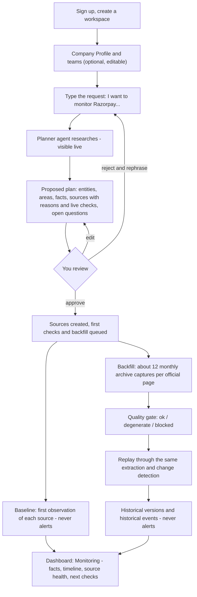
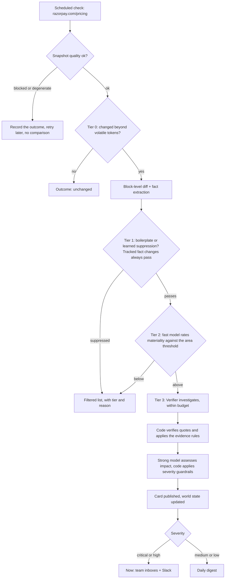
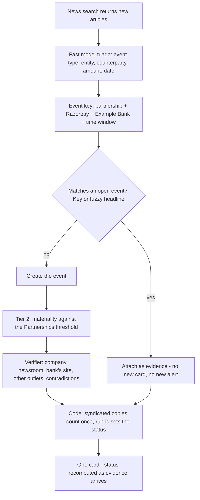
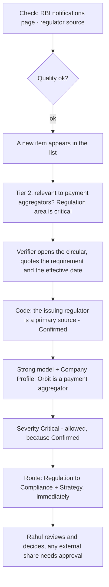
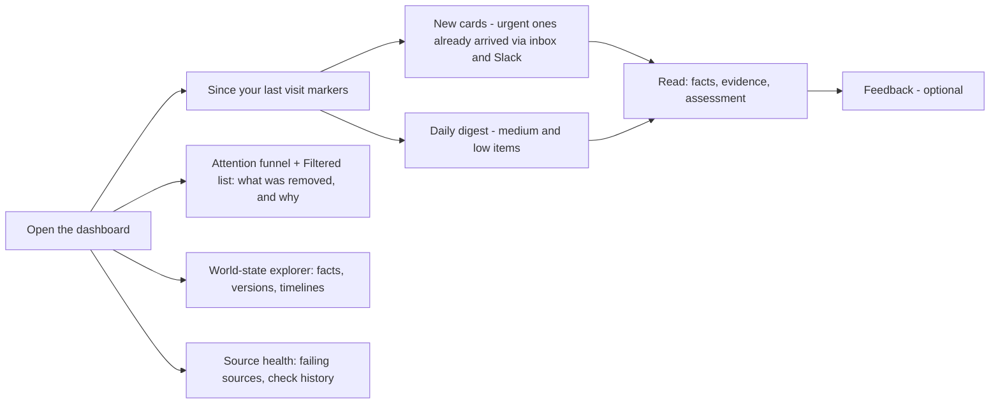
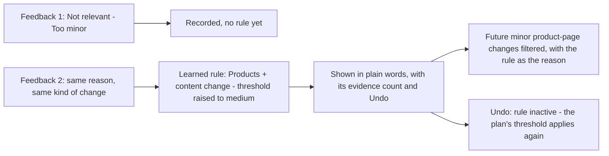
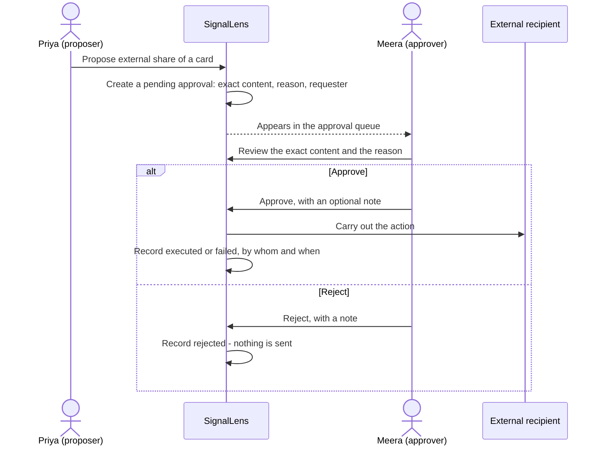
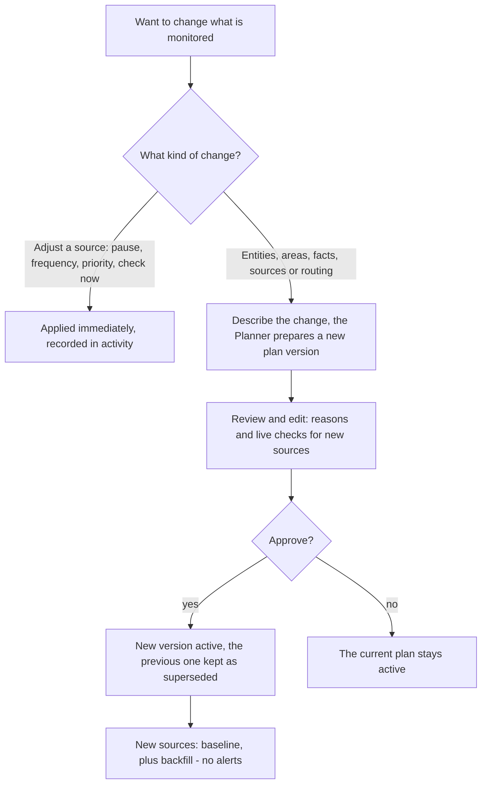
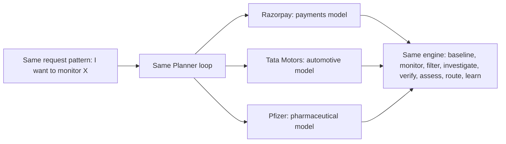

# SignalLens — User workflows

> **What this document is.** Step-by-step workflows showing exactly how SignalLens behaves from
> the user's side and from the system's side. It complements `01-PRODUCT.md` (what the product is
> and why) and follows the v1 scope in `00-SPEC-REVIEW.md` and the v1 interface in
> `api-contract.md`. Anything that is not in v1 is labelled **Roadmap**.
>
> **About the examples.** Razorpay, Tata Motors and Pfizer are real public companies, used only
> as examples; SignalLens is not affiliated with them. Every detected change, date, count,
> Slack message and assessment below is **hypothetical**, as are the customer "Orbit Payments",
> the bank "Example Bank" and the people named. Quoted Razorpay pricing text is from its public
> pricing page as it appeared in September 2026. The Tata Motors and Pfizer domain models are
> **illustrative**: a real plan is generated at onboarding and approved by the user.

## How to read each step

Every step is described through four lenses:

| Lens | Meaning |
|---|---|
| **You see / do** | What appears on screen, and what the user does |
| **System does** | Deterministic software: fetching, comparing, rules, scheduling, routing. Same input, same output |
| **Agent decides** | Where an AI model makes a judgment, and which one: the **Planner** or **Verifier** (agent loops that choose their own next step), a **fast model** (narrow extraction or classification), or a **strong model** (one reasoning call). "Nothing" means the step involves no AI |
| **Human in the loop** | Whether a person makes the decision at this point, while the system waits |

## The cast (all fictional)

- **Orbit Payments** — an online payment gateway for small and mid-sized merchants in India.
  Razorpay is its main competitor.
- **Priya** — product marketing manager at Orbit; the workspace owner and primary user.
- **Meera** — Head of Strategy; she approves plans and external shares.
- **Rahul** — Compliance lead.
- **Teams** — the defaults: Strategy (all areas), Product (products, pricing, technology),
  Compliance (regulation, legal), Sales & BD (partnerships, pricing, customers), Leadership
  (funding, leadership, acquisitions). Product, Sales & BD and Compliance have connected Slack
  channels.

## The workflows

| # | Workflow | Trigger | Human checkpoints |
|---|---|---|---|
| [A](#a-first-time-onboarding) | First-time onboarding | "I want to monitor Razorpay" | Company Profile; plan approval |
| [B](#b-a-pricing-page-change) | A pricing-page change | A scheduled check finds a changed page | Reading, deciding, feedback |
| [C](#c-one-news-event-many-outlets) | One news event, many outlets | News searches return new articles | Reading, feedback |
| [D](#d-a-regulatory-item-routed-urgently-to-compliance) | A regulatory item, routed urgently to Compliance | A regulator's page lists a new circular | Compliance decides; any external share is approved |
| [E](#e-daily-use-what-changed-since-i-last-checked) | Daily use: "what changed since I last checked" | Opening the app; the daily digest | Reading, deciding |
| [F](#f-feedback-becomes-a-learned-rule--and-is-undone) | Feedback becomes a learned rule — and is undone | Feedback with a reason | Feedback; undo |
| [G](#g-proposing-an-external-share--and-approving-it) | Proposing an external share and approving it | A user or the agent proposes sending something outside | Approve or reject |
| [H](#h-editing-the-monitoring-plan) | Editing the monitoring plan | Needs change | Approval of every new plan version |
| [I](#i-the-same-onboarding-for-tata-motors-and-pfizer) | The same onboarding for Tata Motors and Pfizer | A different subject | Plan approval |

**Where humans are in the loop, across every workflow:** approving the monitoring plan (and every
new version of it); approving any action that leaves the company; giving feedback, which is the
only way SignalLens learns; and deciding what to do about any card. Everything else — research,
checking, filtering, investigating, verifying, assessing, routing inside the company — runs on its
own.

---

## A. First-time onboarding

**From "I want to monitor Razorpay" to an active baseline with a year of history.**



**Step 1 — Sign up**
- **You see / do:** Priya signs up with her name, work email, a password and her organisation's
  name, "Orbit Payments".
- **System does:** creates the user and the organisation and signs her in. (v1 uses email and
  password; single sign-on is **Roadmap**.)
- **Agent decides:** nothing.
- **Human in the loop:** —

**Step 2 — Create a workspace**
- **You see / do:** she creates a workspace called "Payments competitors".
- **System does:** creates the workspace with status *setup*, and the five default teams with
  their default areas.
- **Agent decides:** nothing.
- **Human in the loop:** —

**Step 3 — Describe "us": the Company Profile and teams (optional, recommended)**
- **You see / do:** a short form: company name, website, what we do and for whom ("an online
  payment gateway for small and mid-sized merchants"), products, markets ("India", "SMB
  merchants"), competitors already known ("Razorpay"), and the relationship to the subjects
  ("Razorpay is our main competitor"). She adds members to teams, adjusts team areas, and pastes
  Slack webhook addresses for Product, Sales & BD and Compliance.
- **System does:** stores the profile and the teams; notes which teams have Slack connected.
- **Agent decides:** nothing. (Drafting the profile automatically from Orbit's own website is
  **Roadmap**.)
- **Human in the loop:** Priya decides what to share. The profile is optional; without it, "why
  it matters" is necessarily more generic.

**Step 4 — Make the request**
- **You see / do:** she types: *"I want to monitor Razorpay — pricing, products, partnerships and
  regulatory changes."*
- **System does:** creates plan version 1 with status *planning*, starts a Planner run, and sets
  the workspace to *planning*. The screen shows the Planner's steps as they happen, refreshing
  every couple of seconds.
- **Agent decides:** the Planner decides where to start its research.
- **Human in the loop:** —

**Step 5 — The Planner researches**
- **You see / do:** live, one-line steps such as *"Searched the web: 'Razorpay pricing'"*,
  *"Opened razorpay.com/pricing"*, *"Checked robots.txt for razorpay.com"*.
- **System does:** executes each tool call with the safety rules in force — only public
  addresses (private-network protection), robots.txt honoured, per-site rate limits — and records
  every step. It **validates each candidate source live**: reachable? allowed by robots.txt?
  snapshot quality ok, degenerate or blocked? page title?
- **Agent decides:** the Planner decides:
  - **identity** — this Razorpay (the Indian payments company), its aliases and official domains,
    and not a similarly named company;
  - **domain** — industry *financial services*, sector *payments*, geography *India*, with its
    rationale;
  - **related entities** — products such as Payment Gateway and RazorpayX; regulators such as the
    Reserve Bank of India and NPCI; competitors, including those in the profile;
  - **areas** and their importance, informed by the request and the Company Profile;
  - **facts to track**, with a type and an extraction hint (for example "Standard domestic fee —
    percent — the headline card fee on the pricing page");
  - **sources**, with authority, priority, check interval, whether to backfill, and a reason;
  - **open questions** it cannot answer alone.
- **Human in the loop:** —

**Step 6 — Review the proposed plan**
- **You see / do:** the workspace moves to *awaiting approval*. Priya sees the plan's summary; the
  domain with its rationale; entities with role, description and reason; areas with importance,
  reason and routing; tracked facts with type and hint; sources with reason, authority, priority,
  interval, backfill setting and **live-check result**; and the open questions. She:
  - switches off one source whose live check came back *blocked*;
  - raises "Regulation" to critical and confirms it routes to Compliance and Strategy;
  - adds a second competitor;
  - answers an open question: *"Payments only — not RazorpayX business banking."*
- **System does:** saves her edits to the pending plan. (Edits are allowed only while the plan
  awaits approval.)
- **Agent decides:** nothing — it is waiting for her. If the plan is badly off, she can reject it
  and rephrase the request, and the Planner starts again.
- **Human in the loop:** **Yes — this is the first human checkpoint.** It catches a wrong entity
  or a noisy source before either can cause a single alert.

**Step 7 — Approve**
- **You see / do:** she clicks **Approve**. A confirmation shows how many sources were created and
  how many jobs were queued.
- **System does:** the plan becomes the active monitoring policy (version 1); sources and tracked
  facts are created; first checks and backfill jobs are queued in the same transaction; the
  workspace moves to *baselining*.
- **Agent decides:** nothing.
- **Human in the loop:** the approval is recorded with who approved it and when.

**Step 8 — Baseline: how things stand today**
- **You see / do:** the activity feed fills: *"Baseline recorded: razorpay.com/pricing"*.
- **System does:** fetches each source politely and classifies the snapshot. Each *ok* snapshot is
  stored, and its tracked facts become their first state versions ("observed via live"). The check
  outcome is *baseline*: **no events and no notifications**. A *blocked* or *degenerate* result is
  recorded and retried later; repeated failures show on the dashboard's source health.
- **Agent decides:** a **fast model** extracts the typed values. From the pricing page as it
  appeared in September 2026: standard fee *2%*; introductory offer *"0%\* platform fees for first
  90 days"*; footnote *"Platform fee 2.15% + GST"*.
- **Human in the loop:** —

**Step 9 — Backfill: a year of history**
- **You see / do:** activity such as *"Backfill: 12 archive captures found for
  razorpay.com/pricing; 2 discarded as degenerate"* (illustrative counts).
- **System does:** asks the Internet Archive's Wayback Machine for roughly one capture per month
  over the last 12 months, for every page source with backfill switched on. Each capture passes the
  **quality gate** (captures that are far smaller than the rest — typically error or challenge
  pages — are discarded). The good captures are replayed **in date order** through the same
  extraction and change detection, producing dated **historical** state versions ("observed via
  archive") and historical events. Material historical changes appear as cards labelled
  **Historical**, with the archive capture as evidence. **Historical items never notify anyone.**
- **Agent decides:** a fast model extracts facts from each capture, exactly as for live pages.
- **Human in the loop:** —

**Step 10 — Monitoring begins**
- **You see / do:** the workspace status becomes **Monitoring**. The dashboard shows the Razorpay
  subject card (areas, number of facts, last change); the areas with their importance; source
  health (for example "12 sources · 11 active · 1 failing · next check in 20 min"); a link to the
  historical cards found by backfill; live activity; and an attention funnel that starts counting.
- **System does:** schedules every source's next check at its own interval.
- **Agent decides:** nothing.
- **Human in the loop:** from here on, people are involved only to read and decide, give feedback,
  approve external actions and approve plan changes.

**What Priya has after onboarding:** an approved plan; a baseline for every source; about a year of
history for official pages — "here is how Razorpay's pricing page changed over the last year"; a
scheduler running; and **no alerts yet, by design**.

**If something goes wrong:**

| Situation | What happens |
|---|---|
| The Planner picked the wrong company | Visible in the plan (description, domains, reason); fix it before approving. Later, "Wrong company" feedback adds an exclusion |
| A source fails its live check | Shown in the plan with a note; switch it off or replace it |
| The Planner run fails or exhausts its budget | The plan shows *failed* with the error; resubmit the request |
| A page blocks automated visits | Marked *blocked*, never compared; shown as failing if it persists — never silently skipped |

---

## B. A pricing-page change

**Detected, filtered, investigated, verified, analysed and routed.**

*Hypothetical scenario:* on 28 Sep 2026, a scheduled check of razorpay.com/pricing finds a new line,
"0%\* platform fees for first 90 days". (The line is real page text as of September 2026; the
detection, the previous state and the timings are hypothetical.)



**Step 1 — Scheduled check**
- **You see / do:** nothing yet; the activity feed shows *"Checked razorpay.com/pricing"*.
- **System does:** the scheduler picks the source when it is due and fetches it with a
  conditional request (an unchanged page answers "not modified" almost for free), honouring
  robots.txt and the per-site rate limit. The snapshot is classified *ok*.
- **Agent decides:** nothing.
- **Human in the loop:** —

**Step 2 — Tier 0: did anything real change?**
- **System does:** the content fingerprint differs. After removing volatile tokens (the © year,
  timestamps, relative dates, session IDs), a difference remains. A block-level comparison finds
  two changed blocks: a new line in the pricing section, and reworded text in the cookie banner.
- **Agent decides:** nothing.

**Step 3 — Tier 1: rules**
- **System does:** the cookie-banner block matches a boilerplate rule, so it is **filtered** — kept
  in the Filtered list with *"Tier 1: boilerplate (cookie banner)"*. The pricing block goes on to
  fact extraction.
- **Agent decides:** a **fast model** extracts the tracked facts: standard fee *2%* (unchanged);
  introductory offer *"0%\* platform fees for first 90 days"* (previously: none). That is a value
  change on a tracked fact, so it **always passes** tier 1.

**Step 4 — Tier 2: is it material?**
- **Agent decides:** the fast model rates the change against the plan and learned preferences:
  *"High — a new pricing offer on a tracked fact in Pricing & fees."*
- **System does:** compares the rating with the area's threshold. It is above, so an **event** is
  created (type *pricing*, detected via *attribute* change) with status *investigating*. Its event
  key means that if news coverage of the same offer arrives later, it attaches to this event
  rather than creating a second one.
- **Human in the loop:** —

**Step 5 — Investigate**
- **You see / do:** the activity feed shows *"Investigating: Razorpay pricing change"*; the run
  trace can be opened while it runs.
- **Agent decides:** the **Verifier** chooses its own steps: re-fetch the primary source and quote
  the new line (supports) and the footnote (context); search Razorpay's site for the offer's terms;
  search news for coverage and for anything contradicting it; open two articles; then decide it
  has enough, and stop.
- **System does:** runs each tool call (all read-only), enforces the run's budget (steps, tool
  calls, seconds, cost) and the safety rules, and records every step with its tokens and estimated
  cost.
- **Human in the loop:** —

**Step 6 — Verify (code, not the model)**
- **System does:** checks every quote against the text actually retrieved in this run. A quote
  that does not appear — for example, a paraphrase — is rejected. It classifies sources: the
  pricing page is **primary**; news sites are **independent**. It applies the rubric: a primary
  source supports the claim and none contradicts it, so the status is **Confirmed**. It writes the
  summary: *"Confirmed — Razorpay's official pricing page; no contradicting sources."*
- **Agent decides:** nothing — the status is computed.
- **Human in the loop:** —

**Step 7 — Assess impact**
- **Agent decides:** one **strong-model** call, given the verified facts and Orbit's Company Profile,
  writes:
  - *Why it matters (agent assessment):* a 90-day fee holiday lowers the cost of switching gateways
    for small merchants — Orbit's core segment; expect price objections in new-merchant deals while
    it runs.
  - *Considerations:* review Orbit's own new-merchant offer; brief Sales on positioning against a
    time-limited offer.
  - *Assumptions:* the offer applies to new merchants only (terms not seen); the "2.15% + GST"
    footnote does not change the 2% headline for standard domestic payments (not verified).
  - *Watch next:* the offer's terms and end date; whether other gateways respond.
  - *Proposed severity:* **High**.
- **System does:** applies the guardrails (Confirmed allows any severity, so High stands),
  publishes the card, and updates the world state: the fact "Introductory offer" gets a new version
  — its value, observed 28 Sep 2026, effective date not stated, observed via live page, Confirmed,
  its source, and the event that caused it.

**Step 8 — Route and notify**
- **System does:** "Pricing & fees" routes to Product, Sales & BD and Strategy. Severity High means
  **immediately**: a notification in each team's inbox and a message to each connected Slack
  channel. The attention funnel's "published" count goes up.
- **You see / do:** an illustrative Slack message:
  > **[High · Confirmed]** Razorpay pricing page adds a "0% platform fees for first 90 days" offer
  > · Pricing & fees · Routed to Product, Sales & BD, Strategy · *Open in SignalLens*
- **Agent decides:** nothing — routing is rules.
- **Human in the loop:** —

**Step 9 — Read the card**
- **You see / do:** Priya opens the card: facts on top, the labelled assessment below; the
  evidence with verified quotes; the fact's history (the archive version without the offer, then
  the live version with it); the investigation summary and its full run trace; related cards.
- **System does:** marks it read for her.
- **Human in the loop:** **Yes — people decide what to do.** Product reviews Orbit's new-merchant
  offer; Sales prepares a response. SignalLens does not act on the considerations.

**Step 10 — Feedback**
- **You see / do:** Priya chooses **Relevant → Useful**.
- **System does:** records it (it counts towards alert precision) and shows a short confirmation.
  Had she chosen *"Always tell me immediately"*, Pricing & fees would be raised to critical as a
  visible, undoable rule (see [F](#f-feedback-becomes-a-learned-rule--and-is-undone)).
- **Human in the loop:** feedback is how SignalLens learns.

**Variations**

| If… | Then… |
|---|---|
| The page returns a bot challenge | Quality gate: *blocked*. No comparison, no false "everything was removed" alarm. Repeated failures show on source health |
| Only the © year changed | Tier 0: *unchanged*. Nothing reaches a model |
| An article claims "Razorpay cuts its fees to 0%" | The pricing page (2% headline, a 90-day offer) contradicts that claim. The claim as reported is **Conflicting**, and the card shows both sides |
| The run's budget runs out | The run ends *budget exhausted*; the card shows what was and was not found, and its status reflects only verified evidence |

---

## C. One news event, many outlets

**Clustered into one event, and turned into corroboration.**

*Hypothetical scenario:* Razorpay and **Example Bank** (a fictional bank) announce a partnership.
Over 36 hours, 14 articles appear across 9 sites; 4 of them are syndicated copies of one wire
story.



**Step 1 — The first article arrives**
- **System does:** the scheduled news search *"Razorpay partnership"* returns new items;
  already-seen links are ignored.
- **Agent decides:** a **fast model** triages the item: is it about *this* Razorpay? What type of
  event (partnership)? Counterparty (Example Bank)? Date?
- **System does:** builds the event key — *partnership + Razorpay + Example Bank + time window*. No
  open event matches, so a new event is created.
- **Human in the loop:** —

**Step 2 — Is it material?**
- **Agent decides:** at tier 2, the fast model rates it against the Partnerships area:
  *"Medium — a bank partnership can widen Razorpay's distribution."* That is above the area's
  threshold.
- **System does:** moves the event to *investigating*.

**Step 3 — Investigate**
- **Agent decides:** the **Verifier** looks for primary sources first — Razorpay's newsroom and
  Example Bank's press page — then for further independent coverage, and for contradiction. It
  records quotes with their stance.
- **System does:** runs and records the tool calls within the budget.

**Step 4 — Verify: how the status is reached**
- **System does:** checks the quotes and applies the rules. The status depends only on the
  evidence:

  | Evidence so far | Status |
  |---|---|
  | One article from one publisher | Single source |
  | Articles from two or more distinct publishers, none contradicting | Corroborated |
  | Razorpay's own newsroom confirms it | **Confirmed** |

  Four syndicated copies of the same wire text count as **one** publisher. A forum thread about the
  news is a **community** source: shown as context, never counted. If Orbit had earlier marked a
  publisher *Inaccurate*, that publisher would not count towards corroboration either.
- **Agent decides:** nothing.

**Step 5 — Assess and route**
- **Agent decides:** the strong model explains what it means for Orbit (a bank's merchant base could
  become a Razorpay acquisition channel; watch whether the partnership targets small merchants) and
  proposes **Medium**.
- **System does:** routes Partnerships to Sales & BD and Strategy. Medium means the **daily
  digest**, not an interruption.

**Step 6 — The other 13 articles arrive**
- **System does:** each new item is triaged, gets the same event key (or matches by fuzzy
  headline), and **attaches to the existing event as evidence**. No new event, no new card, no new
  alert. The status is recomputed from the growing evidence.
- **You see / do:** one card whose evidence count grows — for example *"14 articles · 9 sites · 6
  independent publishers after syndication"* — and one entry in the digest.
- **Agent decides:** only the fast-model triage for each new item.

**Result:** 14 articles → 1 event → 1 card → 1 digest entry, **Confirmed**. Clustering turned the
noise into corroboration.

> **Status changes after publication (v1 behaviour).** Evidence can keep arriving after a card is
> published. An upgrade (for example, Single source → Corroborated) updates the card silently; a
> downgrade to **Conflicting** notifies the same teams again in their inbox, because people may
> already have acted on it. This is a default and can be changed.

---

## D. A regulatory item routed urgently to Compliance

*Hypothetical scenario:* the Reserve Bank of India's notifications page lists a new circular
changing merchant-onboarding checks for online payment aggregators, effective from 1 January 2027.



**Step 1 — Check the regulator's page**
- **System does:** the RBI notifications page is a *regulator* source checked every few hours. The
  snapshot is *ok*; the comparison finds a new item in the list of circulars.
- **Agent decides:** a fast model extracts the new item (title, date, link).

**Step 2 — Materiality**
- **Agent decides:** at tier 2, the fast model rates the circular as relevant to online payment
  aggregators, in the **Regulation** area, which the plan marks **critical**.
- **System does:** creates a *regulatory* event and starts an investigation.

**Step 3 — Investigate**
- **Agent decides:** the **Verifier** opens the circular itself, quotes the operative requirement
  and the effective date, looks for the regulator's related press release or FAQ, and searches the
  news for context. It also checks the world state for related earlier events — for example, a
  consultation paper recorded months before would appear as a related card.
- **System does:** records every step.

**Step 4 — Verify**
- **System does:** the issuing regulator is a **primary** source, and the quote is verified, so the
  status is **Confirmed**. Two times are kept apart: **observed** 28 Sep 2026 (when SignalLens saw
  it) and **effective** 1 Jan 2027 (when it bites).

**Step 5 — Assess impact**
- **Agent decides:** the strong model, grounded in the profile ("online payment gateway for small
  merchants in India"), writes that Orbit is likely in scope as a payment aggregator; lists
  considerations (map the requirement to current onboarding controls; estimate the work before the
  effective date); an assumption (*Orbit is in scope — confirm with counsel*); and what to watch
  next (clarifications, industry-body responses, how competitors say they will comply). It
  proposes **Critical**.
- **System does:** Confirmed allows Critical, so it stands. The card is published.

**Step 6 — Route urgently**
- **System does:** Regulation routes to **Compliance** and Strategy; Critical means
  **immediately** — Compliance's inbox and its Slack channel, and Strategy's inbox.
- **You see / do:** Rahul gets:
  > **[Critical · Confirmed]** RBI circular changes merchant-onboarding checks for payment
  > aggregators — effective 1 Jan 2027 · Regulation · *Open in SignalLens*
- **Human in the loop:** —

**Step 7 — Compliance decides**
- **You see / do:** Rahul reads the quoted requirement and the effective date, checks the
  assumptions, and opens the circular from the evidence list. The assessment is the agent's; it is
  not legal advice.
- **Human in the loop:** **Yes.** Rahul decides the response. If he wants to send the card to
  external counsel, that is an external action and goes through approval (see
  [G](#g-proposing-an-external-share--and-approving-it)).

**Variations**

| If… | Then… |
|---|---|
| News reports the circular before the regulator's page is next checked | The news item gets the same event key; the event starts as Single source or Corroborated, and becomes Confirmed when the Verifier finds the circular on the regulator's site |
| Only one outlet reports that "new rules are coming", with no circular | Single source: severity is capped at **High** — still immediate, but never Critical on one report |
| Compliance wants every regulatory item immediately | "Always tell me immediately" keeps Regulation at critical, as a visible rule |

---

## E. Daily use: "what changed since I last checked"



**Step 1 — Open SignalLens after a few days away**
- **You see / do:** Priya opens the dashboard on Monday morning. Everything that arrived since her
  last visit on Friday evening is marked **new**.
- **System does:** records her visit and returns the time of her previous one, so the markers are
  exact for her.
- **Agent decides:** nothing.

**Step 2 — Scan the overview**
- **You see / do:** subject cards (for Razorpay: facts tracked, cards in the last 30 days, last
  change); the areas, each with its configured and **effective** importance (effective importance
  reflects learned rules); the **attention funnel** for the last 7 days — for example
  *1,240 checks → 38 changes → 6 material → 3 alerts* (illustrative); recent cards; live agent
  activity; pending approvals; and source health.
- **System does:** refreshes the overview every few seconds.

**Step 3 — Filter and read**
- **You see / do:** she filters cards by severity, area, entity or evidence status, opens the new
  ones, and reads them. Switching on "historical" shows the cards reconstructed by backfill.
- **System does:** marks cards read.
- **Human in the loop:** she decides what, if anything, to do.

**Step 4 — Look back in time**
- **You see / do:** in the world-state explorer she opens Razorpay → "Introductory offer" and sees
  every version, with observed and effective times, how each was observed, and its evidence status;
  and the entity's timeline of live and historical events.

**Step 5 — Audit the noise**
- **You see / do:** the **Filtered** list shows what was removed and why — for example *"Tier 0:
  only volatile tokens changed"*, *"Tier 1: boilerplate (cookie banner)"*, *"Tier 2: low
  materiality, below the Products threshold"*, *"Tier 1: learned rule — minor product-page
  changes"*.
- **Agent decides:** nothing new; these were decided earlier and recorded.

**Step 6 — Keep sources healthy**
- **You see / do:** one source is failing. She opens its check history (outcomes such as *blocked*,
  *degenerate* or *error*, with HTTP status) and pauses it, changes its frequency, or clicks
  **Check now**.
- **System does:** applies the change immediately and records it.

**Step 7 — The daily digest**
- **You see / do:** medium and low items are gathered into the **daily digest** rather than sent one
  by one; each entry shows the title, severity, evidence status and a link to the card. In v1 the
  digest is posted to each team's Slack channel (where one is connected) and marked in the app;
  an **email digest is Roadmap**. She marks all notifications read.
- **System does:** queues digest items as they are published and delivers them once a day.
- **Human in the loop:** reading and deciding only — nothing in daily use needs an approval.

---

## F. Feedback becomes a learned rule — and is undone

*Illustrative scenario:* over two weeks, Product receives two low-severity cards about minor wording
changes on Razorpay's product pages. Priya marks both **Not relevant → Too minor**.



**Step 1 — First feedback**
- **You see / do:** on the first card, Priya chooses **Not relevant → Too minor**.
- **System does:** records the feedback. One signal is not enough to change behaviour, so no rule is
  created yet; a short message confirms it was noted.
- **Agent decides:** nothing.
- **Human in the loop:** the feedback is her decision.

**Step 2 — Second feedback, same pattern**
- **You see / do:** a week later she gives the same feedback on a similar card. A message appears:
  > *"Because you marked 2 minor product-page changes as not relevant, I now alert only on medium or
  > higher changes there. [Undo]"*
- **System does:** creates a **learned rule** — kind *materiality threshold*; scope *area: products,
  change type: content change*; effect *threshold: medium*; supported by *2 feedback items*; active.
- **Agent decides:** nothing — learning is rule-based and explainable.

**Step 3 — The rule at work**
- **System does:** the following week, a similar minor product-page change is rated low
  materiality and is **filtered**, with the reason *"Learned rule: minor product-page changes
  (threshold raised to medium, based on 2 feedback items)"*. It appears in the Filtered list, not
  in anyone's inbox.
- **You see / do:** the monitoring configuration shows the Products area's effective threshold
  alongside the one in the plan.

**Step 4 — Undo**
- **You see / do:** during Orbit's own launch month, Priya wants every product-page change again. She
  opens **Learned rules**, finds the rule and clicks **Undo**.
- **System does:** marks the rule inactive and records when it was revoked. The plan's threshold
  applies again to future changes. Items filtered while the rule was active stay in the Filtered
  list, where she can still read them.
- **Human in the loop:** **Yes** — every learned rule can be reversed by a person, at any time.

**What each feedback reason teaches**

| Feedback | Learned rule | Effect |
|---|---|---|
| Not relevant → Too minor | Materiality threshold | After repeated signals, raises the threshold for that area and kind of change |
| Not relevant → Not our area | Area importance | Lowers the area's importance: digest instead of immediate |
| Not relevant → Inaccurate (when the card rested on one independent publisher) | Publisher trust | That publisher stops counting towards corroboration in this workspace |
| Not relevant → Wrong company | Entity exclusion | Adds an exclusion to entity resolution, so the similarly named company is ignored |
| Relevant → Always tell me immediately | Area importance | Raises the area to critical |
| Useful, Already knew, Duplicate, Other | — | Recorded and counted in the quality metrics (precision and false alarms); no rule |

---

## G. Proposing an external share — and approving it

*Illustrative scenario:* Priya wants to send the Razorpay offer card to Orbit's external pricing
consultant. Anything that leaves the company needs a person's approval.

An external action can be proposed in two ways: **by a user** ("Propose external share" on a card),
or **by the agent** — the impact analysis may propose an action, such as sharing a regulatory card
with external counsel, with its reason. Either way it is only a **proposal**.



**Step 1 — Propose**
- **You see / do:** on the card, Priya clicks **Propose external share** and gives the recipient
  and a covering message.
- **System does:** creates an **approval** with status *pending*: the action type (share a report
  externally), the exact content that would be sent, the reason, who requested it, and the linked
  card. The dashboard's pending-approvals count goes up. **Nothing has been sent.**
- **Agent decides:** nothing. (For an agent-proposed action, the requester is shown as the impact
  analyst, with its reason.)
- **Human in the loop:** a proposal is not an action.

**Step 2 — Review**
- **You see / do:** Meera opens the **approval queue** and sees the title, the action type, the
  exact recipient, subject and body, the reason, the requester and the linked card. She checks
  that the recipient is right and that nothing internal — such as Orbit-specific assessment — is
  going out that should not.
- **System does:** nothing until she decides.
- **Human in the loop:** **Yes — this is the decision point.**

**Step 3 — Decide**
- **You see / do:** she clicks **Approve** (with an optional note) or **Reject**.
- **System does:** on approval, carries out the action and records *executed*, or *failed* with the
  error. If no email server is configured, an approved email is stored with the approval and marked
  as not delivered, with the reason. On rejection, records *rejected* and sends nothing. Either way
  it records who decided, when, and the result.

**Step 4 — Audit**
- **You see / do:** the card's approvals section shows the proposal and the decision; the activity
  feed shows it too.

**Why it is designed this way.** The agent's autonomy stops at the company boundary. Its research
tools are read-only and cannot send anything, so even a web page trying to manipulate it (prompt
injection) cannot cause an external action. Only an approved action can leave. v1 supports three
external action types: sending an external email, sharing a report externally, and posting to an
external webhook. More action types, such as CRM updates, are **Roadmap**.

> **To validate:** who may approve (any workspace member, or named approvers) and whether people
> may approve their own proposals. The v1 contract records who decided but does not define roles.

---

## H. Editing the monitoring plan

Two kinds of change, handled differently.



**Quick adjustments to a source** (no new plan version):

- **You see / do:** in the monitoring configuration, each source shows its configured interval, the
  adaptive interval in use, next and last check, last change, last outcome and consecutive
  failures. Priya can **pause or resume** a source, **change how often** it is checked, **change its
  priority**, or click **Check now**.
- **System does:** applies the change immediately and records it.
- **Agent decides:** nothing.
- **Human in the loop:** these are her decisions; no approval is needed, because nothing new is
  being watched.

**Structural changes** (a new plan version, approval required):

**Step 1 — Describe the change**
- **You see / do:** Priya asks for what she needs in plain words: *"Also monitor Cashfree Payments'
  pricing page, and stop tracking funding news."*
- **System does:** creates a new plan version with status *planning* and starts a Planner run.
- **Agent decides:** the **Planner** researches the new entity and proposes the updated plan, with
  reasons and live checks for any new sources.

**Step 2 — Review and approve**
- **You see / do:** she reviews and edits the proposed version exactly as in onboarding, then
  approves it — or rejects it, leaving the current plan unchanged.
- **System does:** on approval, the new version becomes the active policy and the previous version
  is kept as **superseded**, so there is always a record of what was monitored, when.
- **Human in the loop:** **Yes — every new plan version needs approval.** SignalLens never changes
  its own plan based on what it reads.

**Step 3 — New sources start safely**
- **System does:** each new source starts with a **baseline**, plus backfill if it is switched on,
  so adding a source never produces a burst of alerts. Sources that are no longer monitored stop
  being checked; their history stays in the world state.

**Learned rules are shown alongside the plan.** Each area shows its importance in the plan and its
effective importance after learned rules, so it is always clear how feedback has adjusted it.

> **To validate:** whether a new plan version is drafted as an edit of the current one (with a
> visible "what changes" view) or from the new request alone. The v1 contract supports new versions
> and approval; a comparison view would make reviews faster.

---

## I. The same onboarding for Tata Motors and Pfizer

The steps are identical to workflow A. What changes is the **domain model** the Planner discovers —
the entities, areas, facts and sources. That is the proof that SignalLens is domain-agnostic: the
engine is fixed; the model of each domain is discovered, then approved by a person.

> **Illustrative.** The domain models below show the *kind* of plan the Planner would propose. A
> real plan is generated at onboarding, validated live, and edited and approved by the user.



### Side by side

| | Razorpay | Tata Motors | Pfizer |
|---|---|---|---|
| **Example request** | "Monitor Razorpay — pricing, products, partnerships and regulation" | "Monitor Tata Motors — EVs, pricing, launches, plants and regulation" | "Monitor Pfizer — pipeline, approvals, deals and safety" |
| **Industry / sector** | Financial services / payments | Automotive / passenger, commercial and electric vehicles | Pharmaceuticals / biopharma |
| **Geographies** | India | India, plus the UK and other markets through Jaguar Land Rover | Global — US and EU first, others by the customer's markets |
| **What the "products" are** | Payment products (Payment Gateway, RazorpayX) | Vehicle models (for example Nexon EV) and variants | Marketed medicines and vaccines, and pipeline candidates |
| **Regulators and bodies** | Reserve Bank of India, NPCI | Road-transport ministry, the ministry running EV incentive schemes, the Bharat NCAP safety-rating programme | US FDA, EMA, and others relevant to the customer |
| **Typical areas** | Pricing & fees, Products, Partnerships, Regulation, Funding, Leadership | Launches & models, Pricing, EV & batteries, Manufacturing & capacity, Sales volumes, Regulation & incentives, Partnerships & supply chain, Results | Pipeline & trials, Regulatory decisions, Patents & exclusivity, Deals & licensing, Manufacturing & supply, Pricing & access, Leadership, Guidance |
| **Example tracked facts** | Standard domestic fee (percent); Introductory offer (text); Products listed (list) | Starting ex-showroom price of a model (money); EV models on sale (list); Monthly domestic sales (number); Announced plant capacity (number) | Phase of a pipeline candidate (text); Approved indications of a medicine (list); Candidates in Phase 3 (list); Full-year revenue guidance (money); Next scheduled regulatory decision (date) |
| **Primary sources** | razorpay.com; the RBI's website | Tata Motors' newsroom, investor-relations and model pages; ministry notifications; Bharat NCAP results | Pfizer's pipeline page, press releases and investor relations; FDA and EMA pages; statutory registries such as ClinicalTrials.gov (monitored as pages in v1) |
| **What a material change looks like** | A new fee offer; a new product; an RBI circular | A price revision on a tracked model; a new EV launch; a change to incentive rules; a monthly sales figure well outside the trend | A candidate moving phase; an approval or rejection; a licensing deal; a safety communication; a change to guidance |
| **Who it typically routes to** (depends on the customer) | Pricing owners, Sales, Compliance | Product planning, Sales, Supply chain, Compliance | R&D strategy, Business development, Regulatory affairs, Market access |
| **Open questions the Planner might ask** | "Payments only, or RazorpayX business banking too?" | "The group as a whole, or specific businesses — passenger, commercial, EV, Jaguar Land Rover?" | "Which therapeutic areas matter to you?" and "Which markets' regulators?" |

### The discovered entity trees (illustrative)

```
Tata Motors (company · subject)            Pfizer (company · subject)
|-- Products                               |-- Products
|   |-- Nexon EV (product)                 |   |-- marketed medicines and vaccines (products)
|   |   |-- starting price   money         |   |   `-- approved indications   list
|   |   `-- safety rating    text          |   `-- pipeline candidates (products)
|   `-- EV models on sale    list          |       `-- phase                  text
|-- Sales volumes                          |-- Regulatory decisions
|   `-- monthly domestic sales  number     |   `-- regulated by -> US FDA, EMA (regulators)
|-- Manufacturing & capacity               |-- Deals & licensing
|   `-- announced capacity   number        |   `-- partners with -> BioNTech (company)
|-- Regulation & incentives                |-- Patents & exclusivity
|   `-- regulated by -> road-transport     |   `-- loss-of-exclusivity date   date
|       ministry (regulator)               `-- Guidance
`-- related -> Jaguar Land Rover (company)     `-- full-year revenue guidance   money
```

### What stays the same, and what changes

**The same for every subject:** the loop; the Company Profile and routing; the snapshot quality
gate and the four materiality tiers; the Verifier and the evidence rules (primary sources are still
the entity's own domains, the issuing regulator and statutory registries); the world-state model
(entities of any kind, typed facts, versions with observed and effective times); and every trust
and safety rule.

**Different for each subject:** which entities exist (vehicle models; drug candidates), which facts
are tracked and their types, which sources count as primary, how often each source is checked
(monthly sales figures; regulatory decision calendars), and which of the customer's teams should
hear about what.

**Timing matters differently too.** For Pfizer, the gap between when a decision is *announced* and
when it *takes effect* is often what matters; for Tata Motors, a monthly sales number is a new
value every month, and materiality depends on how far it moves. Both are handled by the same
observed-versus-effective time on every state version, and by the same materiality tiers.
